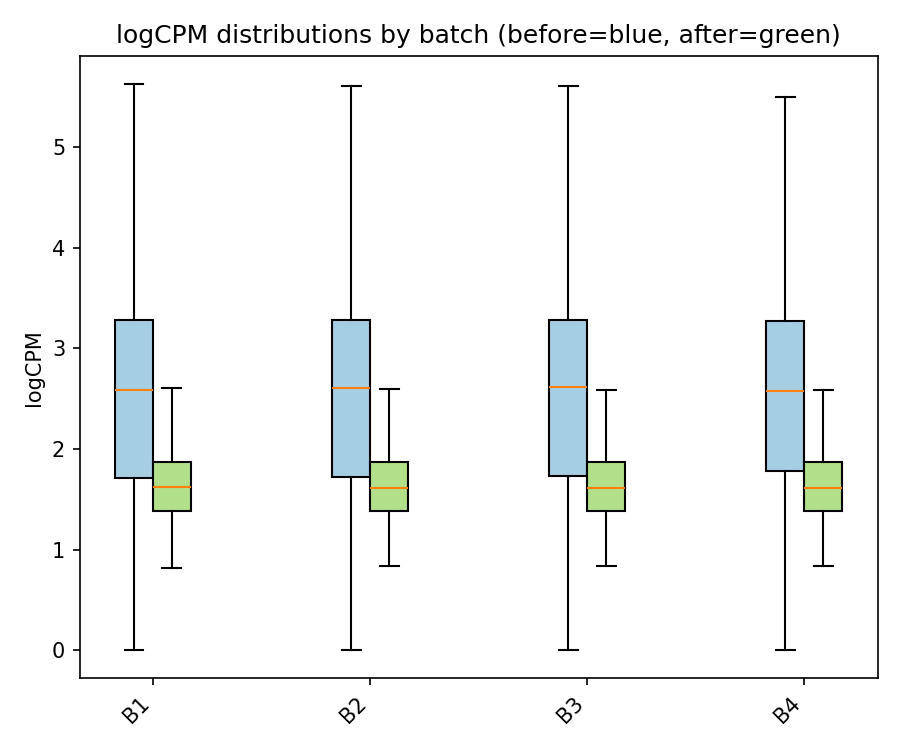

# Neural Network Batch Correction (Adversarial Autoencoder)

<p align=center>

</p>

An adversarial autoencoder for bulk RNA-seq batch effect correction. It learns a latent representation that preserves biological signal (optional supervised head) while discouraging batch-specific variation via a gradient reversal adversary. Outputs a batch-corrected expression matrix (logCPM scale) and optional latent embedding plus visual diagnostics.

---
## Key Features
- Counts → library-size normalisation → CPM → log1p
- Optional highly-variable gene (HVG) selection
- Per‑gene z-score standardisation for stable optimisation (then inverse transformed to logCPM)
- Autoencoder + gradient reversal batch classifier (domain adversarial)
- Optional supervised label head to preserve biology (e.g. condition)
- Flexible adversarial lambda schedules: linear | constant | sigmoid | adaptive
- Multiple reconstruction losses: MSE | MAE | Huber
- Optional mixed precision (AMP) on CUDA
- Early stopping + LR schedulers (plateau / cosine)
- Gradient accumulation for large models / small GPUs
- Weights & Biases logging (offline or online)
- Post-training PCA + boxplot visualisations (before/after correction)
- Latent silhouette diagnostics (batch & label)
- Robust input orientation detection (genes×samples or samples×genes)

---
## Repository Structure (selected)
- `NN_batch_correct.py`  Main training + correction script
- `visualise.py`         Standalone PCA / boxplot + architecture diagram utilities
- `bulk_counts.csv`      Example counts matrix (shape: genes × samples or samples × genes)
- `sample_meta.csv`      Example metadata (columns include sample,batch[,condition])
- `corrected_*.csv`      Example outputs (logCPM after correction)
- `latent*.csv`          Saved latent embeddings
- `nn_architecture.png`  Autoencoder + adversary schematic
- `pca_before.png` / `pca_after.png`  PCA plots pre/post correction
- `logCPM_boxplots.png`  Distribution comparison of logCPM per batch

---
## Input Formats
### Counts CSV
- Either genes in rows & samples in columns (common) OR samples in rows & genes in columns.
- Index (first column) must be feature IDs (genes) or sample IDs; orientation is auto‑detected / override with `--genes_in_rows`.

### Metadata CSV
Must include at minimum:
- `sample` (configurable via `--sample_col`)
- `batch`  (configurable via `--batch_col`)
Optional:
- Biological label column (e.g. `condition`) for supervised preservation (`--label_col`).

### Matching
Samples present in both files are intersected. If <2 overlaps are found an orientation / whitespace rescue pass is attempted before failing.

---
## Installation
Create & activate a Python environment (>=3.10 recommended). Then:

```powershell
pip install -r requirements.txt
```

Optional extras:
- Set `WANDB_MODE=offline` to avoid network usage.

---
## Quick Start
Minimal unsupervised run (only batches):
```powershell
python NN_batch_correct.py `
  --counts bulk_counts.csv `
  --metadata sample_meta.csv `
  --genes_in_rows `
  --out_corrected corrected_logCPM.csv
```

With supervised label preservation + latent export + model save + visualisations:
```powershell
python NN_batch_correct.py `
  --counts bulk_counts.csv `
  --metadata sample_meta.csv `
  --genes_in_rows `
  --label_col condition `
  --hvg 5000 `
  --latent_dim 32 `
  --enc_hidden 1024,256 `
  --dec_hidden 256,1024 `
  --adv_hidden 128 `
  --sup_hidden 64 `
  --adv_lambda_schedule adaptive `
  --adv_weight 1.0 `
  --sup_weight 1.0 `
  --epochs 200 `
  --batch_size 64 `
  --dropout 0.1 `
  --recon_loss mse `
  --out_corrected corrected_logCPM.csv `
  --out_latent latent.csv `
  --save_model model_best.pt `
  --generate_viz `
  --viz_hvg_top 2000
```

Enable AMP (CUDA) + cosine scheduler + W&B logging:
```powershell
$env:WANDB_MODE="offline"  # optional
python NN_batch_correct.py `
  --counts bulk_counts.csv `
  --metadata sample_meta.csv `
  --genes_in_rows `
  --adv_lambda_schedule sigmoid `
  --scheduler cosine `
  --amp `
  --use_wandb `
  --out_corrected corrected_logCPM.csv
```

---
## Important Arguments (abridged)
- `--counts / --metadata`  Input files
- `--genes_in_rows`  Set if counts file is genes×samples
- `--hvg N`  Keep top-N variable genes (0 = all)
- `--label_col`  Enable supervised biology head
- `--adv_lambda_schedule`  linear | constant | sigmoid | adaptive
  - adaptive: dynamically scales GRL lambda toward near-random adversary accuracy
- `--adv_weight / --sup_weight`  Relative loss contribution scalars
- `--recon_loss`  mse | mae | huber
- `--grad_accum`  Gradient accumulation steps
- `--scheduler`  none | plateau | cosine
- `--amp`  Mixed precision (GPU)
- `--expected_batches`  Assert exact number of batches present
- `--label_values`  Comma list of required labels per batch (quality control)
- `--out_corrected`  Output corrected matrix (logCPM)
- `--out_latent`  (Optional) latent embedding CSV
- `--save_model`  Save trained weights & metadata
- `--generate_viz`  Trigger PCA + boxplots (uses `visualise.py` functions)

Run `python NN_batch_correct.py -h` for the full list.

---
## Output Files
- Corrected matrix: samples × genes (logCPM scale) ready for downstream analysis.
- Latent embedding: `z1..zK` columns (optional).
- Saved model `.pt`: includes state_dict, class labels, gene list.
- PCA plots: pre & post correction (`--generate_viz`).
- Boxplots: logCPM distributions before vs after, per batch.
- Silhouette scores (printed): lower batch, higher label = good disentanglement.

---
## Visualisation Script (`visualise.py`)
You can run it standalone (e.g. after modifying parameters):
```powershell
python visualise.py `
  --counts bulk_counts.csv `
  --metadata sample_meta.csv `
  --genes_in_rows `
  --corrected corrected_logCPM.csv `
  --hvg_top 2000
```
It will regenerate PCA plots and boxplots. Without `--corrected`, only "before" plots are produced.

An architecture diagram is generated automatically as `nn_architecture.png` the first time `visualise.py` is executed.

---
## Adversarial Lambda Schedules
- linear: ramps 0 → adv_weight across first ~1/3 of epochs
- constant: fixed adv_weight
- sigmoid: slow start, sharp middle growth, saturates
- adaptive: adjusts each epoch to keep adversary accuracy near random; prevents over/under powering the encoder

---
## Reproducibility
Use `--seed` (default 42). Seed applies to Python, NumPy, and Torch (CPU & CUDA). For completely deterministic CUDA runs you may need extra backend flags (not set here to retain performance).

---
## Typical Workflow
1. Inspect and clean metadata (consistent sample IDs)
2. Run a baseline correction (unsupervised) & inspect PCA / boxplots
3. Add label supervision if biological grouping should be preserved
4. Try alternative lambda schedules (adaptive vs linear)
5. Tune latent dimension / hidden widths (watch overfitting via val loss)
6. Export latent embedding for downstream clustering / differential analyses

---
## Inference on New Data (Conceptual)
Currently the script trains & corrects in one pass. To reuse a saved model on new samples:
1. Load the `.pt` file
2. Apply the same preprocessing: library-size normalise → log1p → (restrict to training genes) → z-score using training stats (not yet stored separately; extending the checkpoint to save scaler mean/std would be a small enhancement)
3. Run encoder→decoder forward pass to obtain corrected logCPM (after inverse standardisation)

(Enhancement idea: save scaler mean/std in checkpoint for direct reuse.)

---
## Requirements
See `requirements.txt` (PyTorch CPU version shown; install CUDA variant as needed).

---
## Troubleshooting
- Shape / overlap errors: confirm sample IDs exactly match between counts & metadata (case, whitespace).
- Few overlapping samples: verify orientation; try adding `--genes_in_rows`.
- Adversary dominates (batch acc ~1.0, poor reconstruction): try `--adv_lambda_schedule adaptive` or lower `--adv_weight`.
- Biological separation lost: add / tune `--label_col` and increase `--sup_weight` moderately.
- Slow training: reduce hidden sizes or HVG count; enable `--amp` on GPU.

---
## License
MIT (see header in source). Cite this repository if you use it in a publication.

---
## Acknowledgements
Inspired by domain adversarial training paradigms (Ganin & Lempitsky) adapted for bulk RNA-seq batch correction.

---
Happy correcting!
